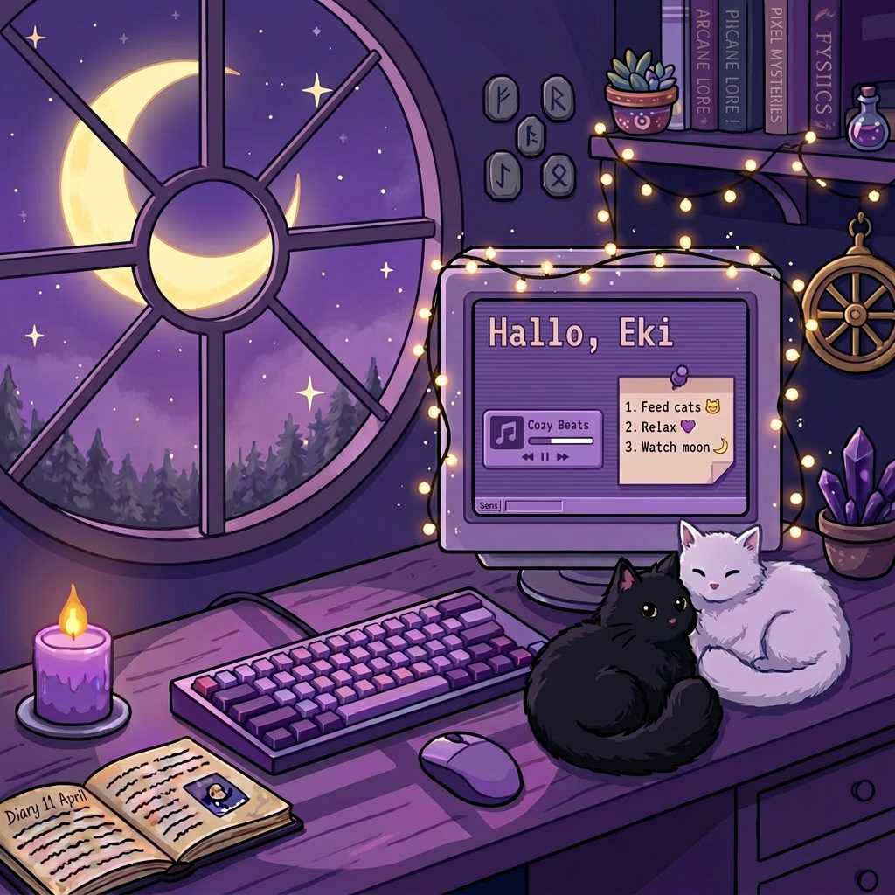

<!-- Gambar Banner Utama -->

# Hallo, I'm Eki! 

*Just an ordinary person enjoying the quiet moments in life.*

[ 🎧 Listening to Music ] · [ 🐱 Cat Lover ] · [ 🌙 Moon Gazer ]

---

### 🌙 About Me
Halo! Aku Eki. Aku hanya orang biasa yang kebetulan mampir ke GitHub. Aku sangat menyukai hal-hal yang berbau estetika retro, pixel art, dan suasana malam yang tenang. 

Jika kamu mampir ke sini, silakan seduh teh hangat, putar lagu favoritmu, dan mari bersantai sejenak! ☕

---

### 💌 Daily Reminder
> *"Sometimes, the most productive thing you can do is relax and watch the stars."* ✨

